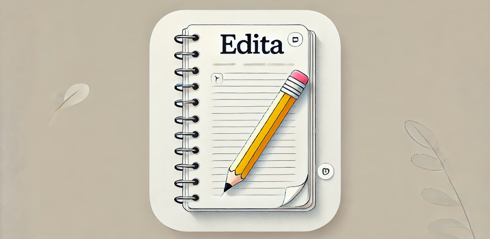
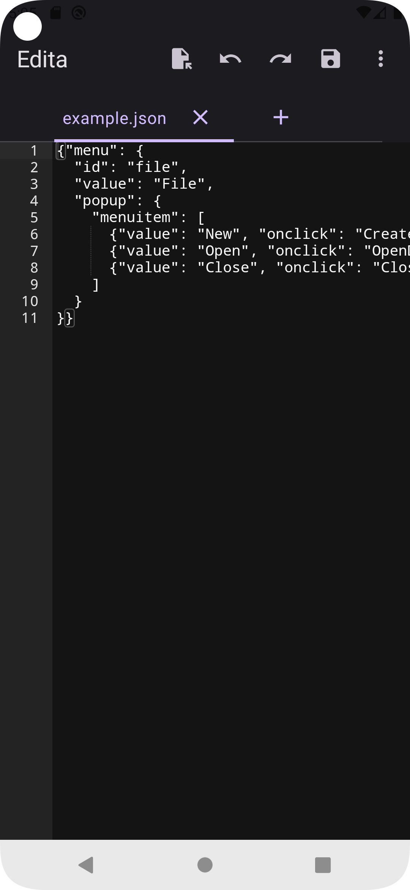

# Edita

## Overview

Just a simple, free, open source, monospace text editor. No ads. No premium version. **Edita** does not collect or transmit any information and runs entirely on your device.

## Screenshots

  
  
  
  
  

## Settings

Edita offers a variety of customizable settings to enhance your editing experience:

- **Display Line Numbers**: Toggle line numbers on or off for easier code navigation.
- **Adjustable Font Size**: Customize the font size to suit your reading and writing preferences.
- **Word Wrap**: Enable or disable word wrap to control how long lines of text are handled.
- **Auto Indent**: Automatically indent new lines to maintain code structure and readability.
- **Theme Options**: Choose from system theme, dark theme, or light theme based on your preference.

## Usage

Open the application and start typing!
Use the menu options for additional functionality like saving files, opening existing documents, changing settings, and more.

## License

Edita is licensed under the BSD 3-Clause License. See the [LICENSE](LICENSE) file for more information.

## Contact

For any questions or feedback, please open an issue on the [GitHub repository](https://github.com/jacastromad/edita/issues).

---

